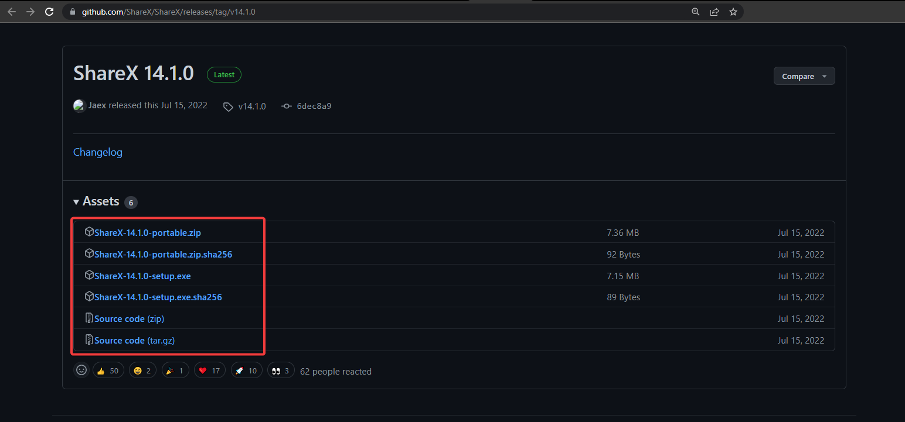

= Downloading ShareX on Windows 

image:images/ShareX.png[ShareX] 

ShareX gives you the option to download either the setup file (.exe) or a portable version. 

Both versions are available through their original website or through Windows store. 

== Via SHareX website

To Download ShareX through their original website:

. Visit https://getsharex.com/[getshareX] to access their downloadable files through Github
. Click on Download. You will be directed tot heir gGithub page with the latest versions of ShareX 

. Click on the version you want from the list 

. Wait for the download to happen

== Via Microsoft Store
To Download ShareX through the Microsoft Store:

. Visit your Microsoft Store app

. Search for ShareX on the search tab
image:images/.png[ShareX on Microsoft store]
. Click on ShareX to reveal details 

. Click Get app and wait for the download to happen 

