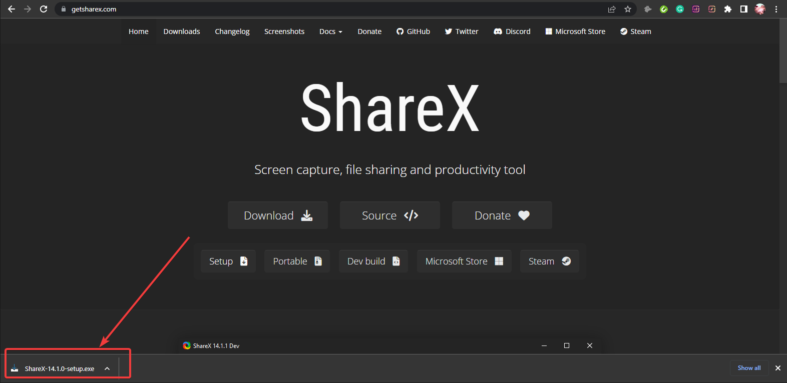
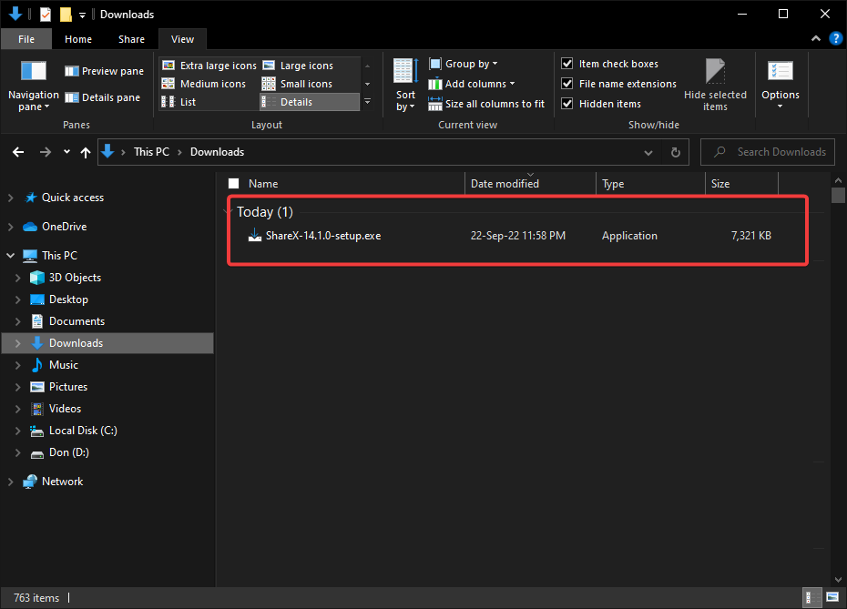

= Setting Up ShareX
This page details how to set up your ShareX app after downloading it. 

== Setup

Follow these instructions after downloading ShareX, either through their official website or through th Microsoft Store App. 

. Look for the downloaded file. It should be in the form of an executable (.exe) file +
.. Executable file on your Googl Chrome browser
+

+
.. Executable file from Download section
+

. Click on it and wait for the installation process to start. 

