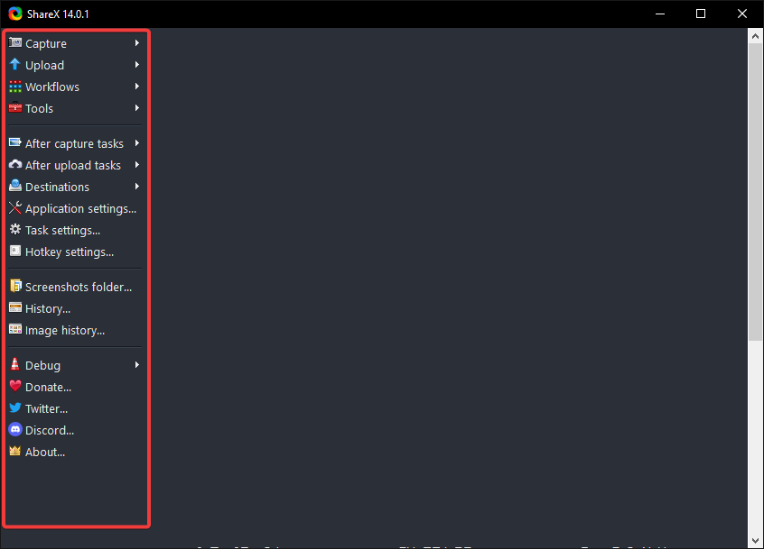
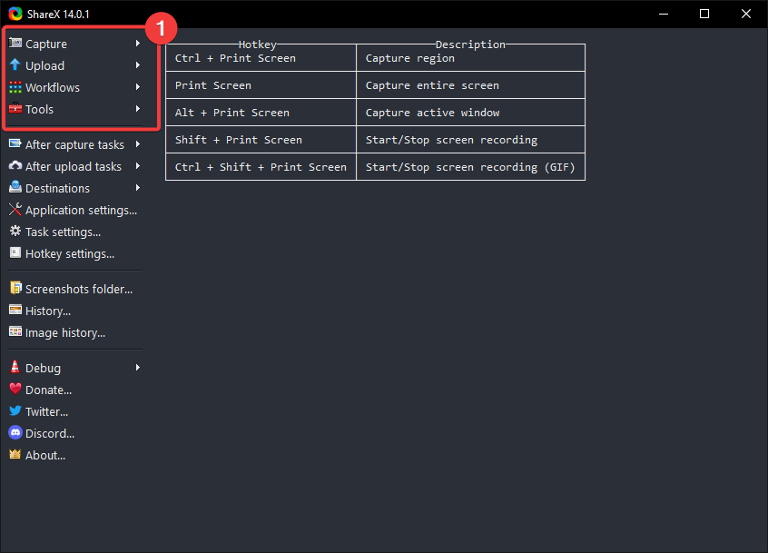
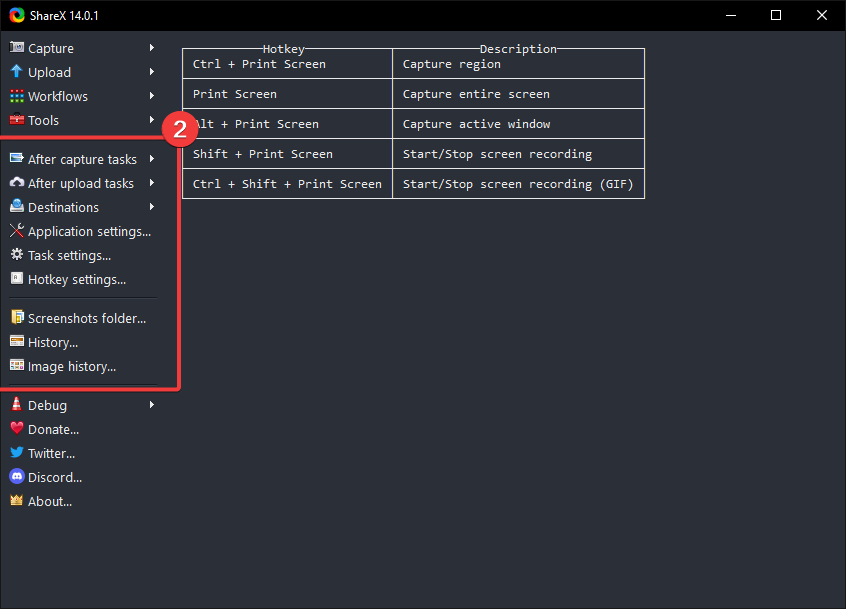
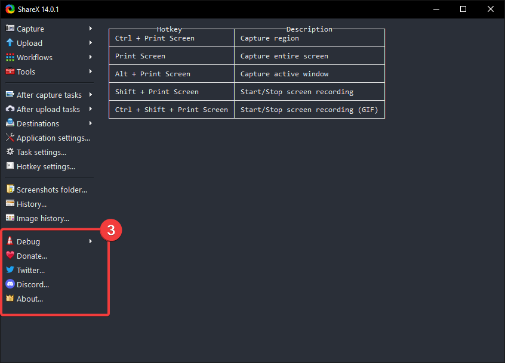

= Basics
This page describes what you see on the terminal and their functions. 

On the face of it, ShareX seems to have too much going on at the same time. Luckily, however its designers had the sense to separate different sections based on uses.+

== ShareX Terminal 
ShareX allows you to perform various actions through its terminal. 

These include:

. Capture high definition screenshots of different Windows, your monitor, and specific regions among other actions. 
. Configure different settings
. Set up screenshots folders
. Connect to social platforms

== Actions 

The Actions tab provides keys to help you perform different functions. 

These include: 

* Capture Screenshots and Screen recordings
* Upload functions for files, folders and text
* Workflow functions
* Different Tools

== Configurations and Settings

The Configurations and Setting stab provides you with the option to configure different areas of ShareX. 

These include:

* After Capture tasks
* After upload tasks
* Destinations
* Application settings
* Task settings
* Hotkey settings

== Debug and Socials

The Debug key provIdes you with the option to test different actions provided by ShareX. 

These include:

* Test for image upload
* test for text upload
* Test for file upload 
* Test for URL shortener 
* Test for URL sharing