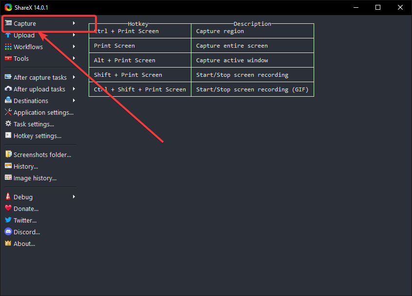

= How to Capture Screenshots Using ShareX
This page details all the different ways to capture screenshots. 

== FullScreen Screenshots
. Click on Capture at the top left side of the screen to open a drop down menu +

. Click on full screen +

== Window
. Click on Capture at the top left side of the screen to open a drop down menu +

. Click on Window to reveal another drop down menu
. Select the window you would like to capture from the list +

== Monitor
. Click on Capture at the top left side of the screen to open a drop down menu +

. Select Monitor to reveal a drop down menu
. Click on the provided screen resolution +

== Region
. Click on Capture at the top left side of the screen to open a drop down menu +

. Select Region
. Use your cursor to select which region to capture

